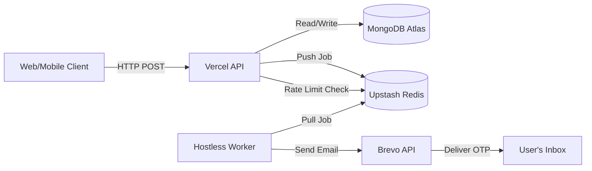

# Architecture Overview

## System Diagram

```mermaid
graph LR
    Client[Web/Mobile Client] -->|HTTP POST| Vercel[Vercel API]
    Vercel -->|Read/Write| Mongo[(MongoDB Atlas)]
    Vercel -->|Push Job| Redis[(Upstash Redis)]
    Vercel -->|Rate Limit Check| Redis
    Hostless[Hostless Worker] -->|Pull Job| Redis
    Hostless -->|Send Email| Brevo[Brevo API]
    Brevo -->|Deliver OTP| UserEmail[User's Inbox]
```
